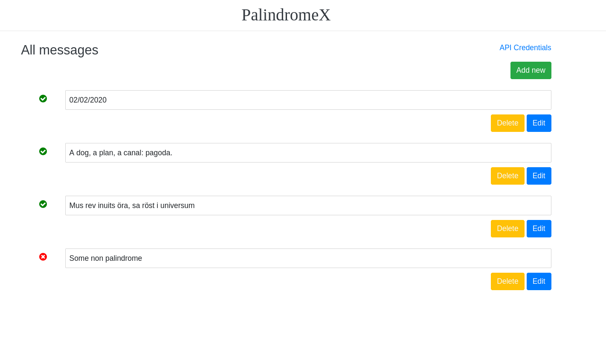
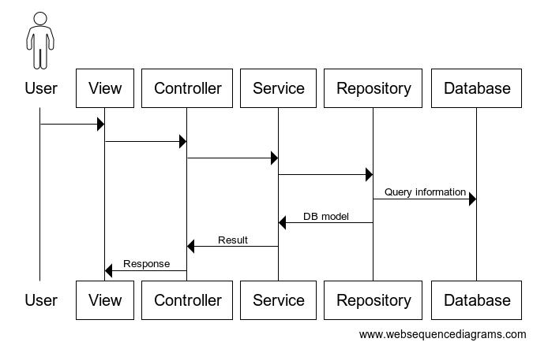

<p align="center">
  <h2 align="center">PalindromeX</h2>

  <p align="center">
    An awesome web app for palindromes!
    <br />
    <a href="https://palindromex.ml/doc/index.html"><strong>API documentation »</strong></a>
    <br />
    <a href="https://palindromex.ml/signup"><strong>View Demo »</strong></a>
  </p>
</p>


## Table of Contents

* [About the Project](#about-the-project)
* [Getting Started](#getting-started)
  * [Prerequisites](#prerequisites)
  * [Installation](#installation)
* [Usage](#usage)
* [Architecture](#architecture)
  * [Built With](#built-with)

## About The Project



PalindromeX is a web app that checks if a word/sentence/number is a palindrome.


## Getting Started

The process of installation is automated and it should be straight forward.


### Prerequisites

The only prerequisite is to have docker installed on your machine.


### Installation

1. Clone the repo
```sh
git clone https://github.com/BojanTH/palindromex
```
2. Enter the project directory and run
```sh
docker-compose --env-file=".env.docker-compose" up
```

## Usage

The app is available at <a href="https://palindromex.ml/signup">PalindromeX</a>.
After successful registration and sign-in, you will be able to create and edit messages in the UI.<br>
To use the API endpoints please generate access token from the messages page ("API Credentials" link in top right corner).<br>
For more details regarding the API please refer to the <a href="https://palindromex.ml/doc/index.html">API documentation</a>.


## Architecture

The app is based on MVC design pattern.<br><br>
The routes are mapped in the Make function (`web/main.go`) which is the application's entry point.<br>
`make` function is responsible for the instantiation of the container that contains stateles objects shared between requests. The container is passed to controllers (handlers).<br><br>

All requests are handeled by controllers (handlers) located in the `web/controller` directory. The logic in the controller is minimal and all domain logic is passed further to the services, located in web/service directory.<br>
Private controllers will allow only aunthenticated and authorized requests.<br><br>

Services are responsible for the business logic. To interact with the database, they are using injected repositories.<br>
All database queries are located in repositories for easier maintenance and reusability.<br>
Models located in `web/model` are mapped to database tables.<br>
Beside of models, there are Data Transfer Object used for easier data transfer between components.<br>

<br>

Authentication for both APIs and UIs is based on JSON Web Tokens. UI requests will obrain temporary token and they will be stored as cookies while API tokens are permanent and they are sent in a header.<br>
To enable users to disable API token, each token is associated with an API Key stored in the database. By disabeling this key the tocken becomes invalid.<br><br>

The app supports three enviroments. It's deployed to Google Cloud (Cloud Run) and supports continuous integration.<br>
By merging new changes to the `main` branch this will trigger a cloud build and deploy without downtime.<br>
Tests are run during the deploy and in case of a failure the build process will be stopped.

### Built With
* Go
* JavaScript (ES6)
* Postgres

Libraries:
* <a href="https://github.com/spf13/cobra">Cobra</a> for CLI commands
* <a href="https://github.com/spf13/viper">Viper</a> for configurations
* <a href="https://github.com/gorilla/mux">Gorilla Mux</a> for routing
* <a href="https://github.com/gorilla/sessions">Gorilla Sessions</a> for sessions
* <a href="https://github.com/swaggo/http-swagger">Swagger</a> for API documentation
* <a href="https://github.com/go-gorm/gorm">Gorm</a> for database interactions
* <a href="https://github.com/webpack/webpack">Webpack</a> and <a href="https://github.com/babel/babel">Babel</a> for JS and CSS compilations and boundling


